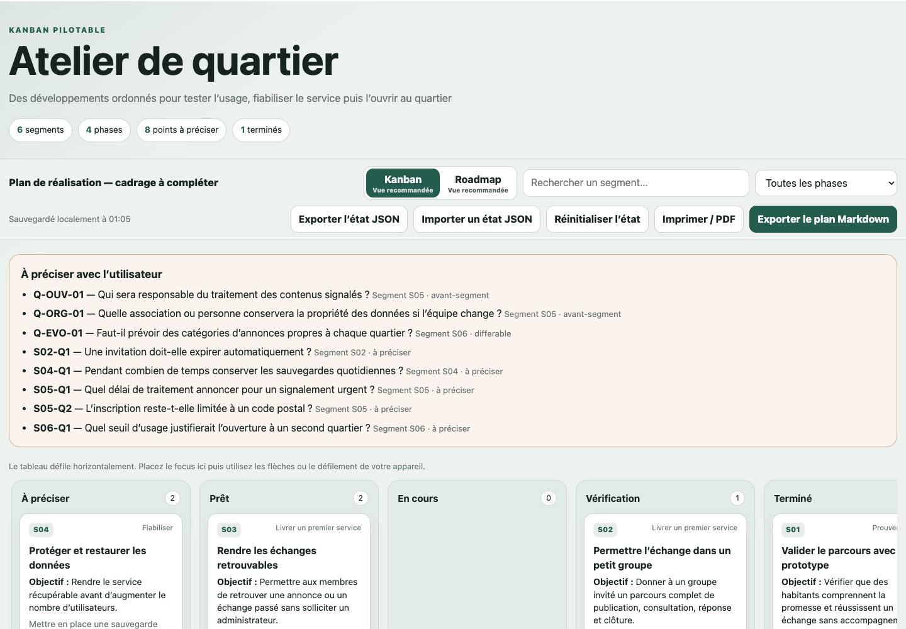
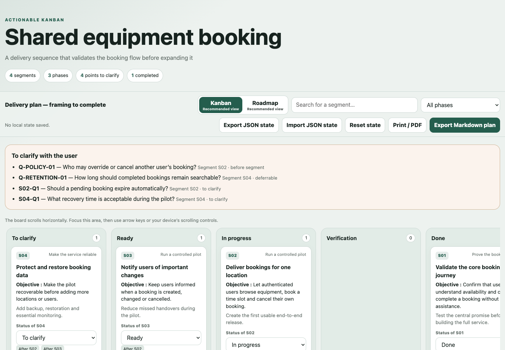

# Concevoir un projet numérique interactif

[Français](#francais) · [English](#english)

Un plugin Codex bilingue pour transformer une idée numérique en décisions traçables, spécification exploitable et plan de réalisation interactif.

A bilingual Codex plugin that turns a digital idea into traceable decisions, an actionable specification and an interactive delivery plan.

---

## Français

### Ce que fait le plugin

Le plugin accompagne progressivement la conception de sites, applications, jeux, services en ligne, outils internes, automatisations, produits connectés et projets IA/data. Il s’adapte à une idée vague comme à un brief déjà précis et ne pose que les questions qui peuvent réellement changer le produit.

Il produit :

- des questionnaires HTML interactifs avec six formats de réponse ;
- un registre de décisions traçable avec hypothèses et décisions différées ;
- une spécification consolidée reliée aux décisions ;
- un plan unique basculable entre Kanban pilotable et roadmap horizontale ;
- un bouton dans le plan pour revenir directement aux questions ;
- des exports JSON et Markdown, une sauvegarde locale et des archives vérifiables.

Les fiches fonctionnent hors ligne, n’envoient aucune donnée vers un service externe et sont ouvertes dans le navigateur intégré à Codex lors de leur génération.

### Aperçu

#### Questionnaire interactif

#### Roadmap

#### Kanban pilotable

### Installation depuis GitHub

Ajouter le dépôt comme marketplace Git puis installer le plugin :

~~~bash
codex plugin marketplace add nettyks/concevoir-projet-interactif --ref main
codex plugin add concevoir-projet-interactif@nettyks
~~~

Ouvrir ensuite une nouvelle tâche Codex pour charger le skill du plugin.

### Utilisation

~~~text
Utilise $concevoir-projet-interactif pour m’aider à cadrer ce projet numérique : [décrire le projet].
~~~

Le contenu généré utilise `locale: "fr"` par défaut. Utiliser `"en"` pour produire l’interface, les questions, les statuts, l’accessibilité et les exports en anglais.

---

## English

### What the plugin does

The plugin progressively frames websites, applications, games, online services, internal tools, automations, connected products and AI/data projects. It works with an early idea or a detailed brief and asks only questions that can materially change the product.

It produces:

- interactive HTML questionnaires with six answer formats;
- a traceable decision register with assumptions and deferred decisions;
- a consolidated specification linked to decisions;
- one delivery plan that switches between an actionable Kanban and a horizontal roadmap;
- a button in the plan to return directly to the questions;
- JSON and Markdown exports, local saving and verifiable archives.

The sheets work offline, do not send data to any external service and open in Codex's integrated browser when generated.

### Preview

#### Interactive questionnaire

#### Actionable Kanban

### Install from GitHub

Add the repository as a Git marketplace, then install the plugin:

~~~bash
codex plugin marketplace add nettyks/concevoir-projet-interactif --ref main
codex plugin add concevoir-projet-interactif@nettyks
~~~

Start a new Codex task afterwards so the plugin skill is loaded.

### Usage

~~~text
Use $concevoir-projet-interactif to frame this digital project: [describe the project].
~~~

Use `locale: "en"` for English output or `"fr"` for French output. Technical identifiers remain stable between both languages.

---

## Structure

~~~text
concevoir-projet-interactif/
├── .agents/plugins/marketplace.json
├── .github/workflows/tests.yml
├── plugins/
│   └── concevoir-projet-interactif/
│       ├── .codex-plugin/plugin.json
│       ├── assets/
│       ├── skills/
│       │   └── concevoir-projet-interactif/
│       │       ├── SKILL.md
│       │       ├── agents/
│       │       ├── assets/
│       │       ├── references/
│       │       └── scripts/
│       └── tests/
└── README.md
~~~

The repository is a Git marketplace containing one skill-only plugin. It does not require an MCP server or a remote application.
