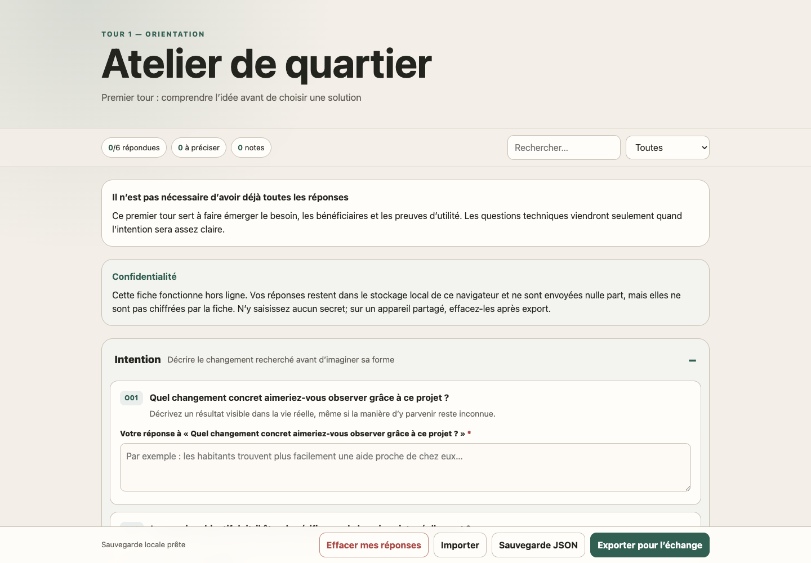
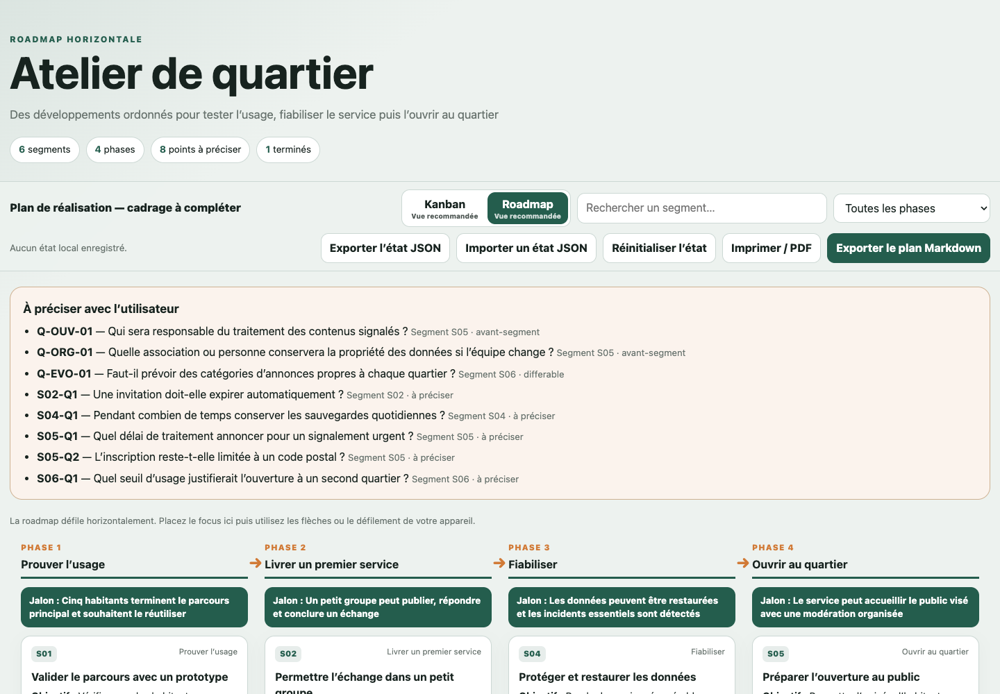

# Concevoir un projet numérique interactif

Ce dossier contient un skill Codex complet pour explorer, cadrer et planifier un projet numérique au moyen de questionnaires interactifs, d'un registre de décisions et d'un planning Kanban/roadmap.

## Aperçu

### Questionnaire interactif



### Roadmap



### Kanban pilotable


## Installation depuis le ZIP

1. Ajouter le fichier ZIP à une conversation dans Codex.
2. Copier-coller le prompt ci-dessous.
3. Le skill sera utilisable à partir du tour suivant, une fois l'installation confirmée.

## Installation depuis GitHub

Donner l'adresse du dépôt à Codex avec ce prompt :

```text
Installe le skill Codex disponible dans ce dépôt GitHub :
https://github.com/nettyks/concevoir-projet-interactif

Installe le dépôt complet dans `~/.codex/skills/concevoir-projet-interactif` sans écraser une installation existante. Vérifie ensuite le skill, lance ses tests et confirme qu'il sera disponible au prochain tour.
```

## Prompt à copier-coller dans Codex

```text
Installe le skill contenu dans ce fichier ZIP.

Décompresse et copie le dossier complet `concevoir-projet-interactif` dans `~/.codex/skills/` en conservant toute son arborescence (`SKILL.md`, `agents`, `assets`, `references`, `scripts` et `tests`).

Avant toute écriture, vérifie que l'archive ne contient pas de chemin sortant de son dossier. Si `~/.codex/skills/concevoir-projet-interactif` existe déjà, ne l'écrase pas et demande-moi quoi faire.

Après l'installation :
- vérifie que `SKILL.md` est valide avec le validateur de skills disponible ;
- lance les tests avec `python3 -B -m unittest discover -s tests -v` depuis le dossier du skill ;
- confirme-moi le chemin installé, le résultat des validations et que le skill sera disponible au prochain tour.
```

## Utilisation

Dans une nouvelle demande, mentionner explicitement le skill :

```text
Utilise $concevoir-projet-interactif pour m'aider à cadrer ce projet numérique : [décrire le projet].
```

## Contenu du dossier

- `SKILL.md` : instructions principales du skill.
- `agents/` : métadonnées d'affichage dans Codex.
- `assets/` : modèles de questionnaire, planning, documents de conception et captures d'écran.
- `references/` : méthode, exemples et schémas JSON.
- `scripts/` : génération et validation des artefacts.
- `tests/` : tests automatisés du skill.

Le fichier `SKILL.md` seul ne suffit pas : partager et installer le dossier complet.
