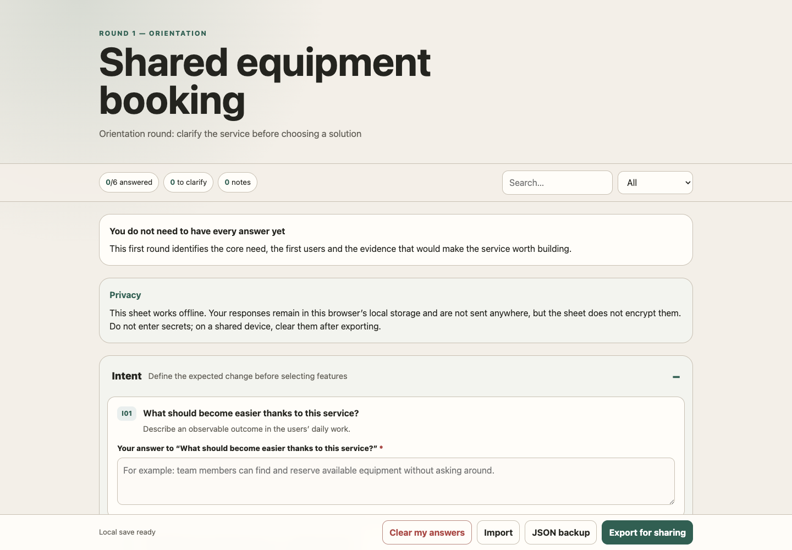

# Concevoir un projet numérique interactif

[Français](#francais) · [English](#english)

Un skill Codex bilingue pour transformer une idée numérique en décisions traçables, spécification exploitable et plan de réalisation interactif.

A bilingual Codex skill that turns a digital idea into traceable decisions, an actionable specification and an interactive delivery plan.

---

## Français

### À quoi sert ce skill ?

Ce skill accompagne progressivement la conception de tout projet numérique :

- site web ou application mobile/desktop ;
- jeu vidéo ou expérience interactive ;
- outil interne ou service en ligne ;
- automatisation ou produit connecté ;
- projet IA ou data.

Il s’adapte aussi bien à une idée vague qu’à un brief déjà précis. Il ne pose que les questions qui peuvent réellement changer le produit.

### Ce qu’il produit

- Des questionnaires HTML interactifs adaptés au niveau de maturité du projet.
- Six formats de réponse : texte libre, décision, choix simple, choix multiple, échelle et classement.
- Un registre de décisions traçable avec sources, hypothèses et décisions différées.
- Une spécification consolidée reliée aux décisions.
- Un plan unique consultable en Kanban pilotable ou en roadmap horizontale.
- Des exports JSON et Markdown, une sauvegarde locale et des archives vérifiables.

Les fiches fonctionnent hors ligne et n’envoient aucune donnée vers un service externe.

### Aperçu en français

#### Questionnaire interactif

#### Roadmap

#### Kanban pilotable

### Français et anglais

La propriété JSON `locale` choisit la langue :

~~~json
{
  "locale": "fr"
}
~~~

Utiliser `"en"` pour l’anglais. L’interface, les messages, l’accessibilité, les statuts et les exports Markdown sont traduits automatiquement. Le skill rédige également les questions et le contenu dans la langue demandée.

### Installation depuis GitHub

Donner l’adresse de ce dépôt à Codex avec ce prompt :

~~~text
Installe le skill Codex disponible dans ce dépôt GitHub :
https://github.com/nettyks/concevoir-projet-interactif

Installe le dépôt complet dans ~/.codex/skills/concevoir-projet-interactif sans écraser une installation existante. Vérifie ensuite le skill, lance ses tests et confirme qu’il sera disponible au prochain tour.
~~~

### Installation depuis un ZIP

Ajouter le ZIP à une conversation Codex, puis utiliser :

~~~text
Installe le skill contenu dans ce fichier ZIP.

Décompresse et copie le dossier complet concevoir-projet-interactif dans ~/.codex/skills/ en conservant SKILL.md et tous ses sous-dossiers.

Si une installation existe déjà, ne l’écrase pas sans me demander. Vérifie ensuite le skill, lance python3 -B -m unittest discover -s tests -v et confirme le chemin installé.
~~~

### Utilisation

~~~text
Utilise $concevoir-projet-interactif pour m’aider à cadrer ce projet numérique : [décrire le projet].
~~~

---

## English

### What is this skill for?

This skill progressively guides the design of any digital project:

- website, mobile app or desktop application;
- video game or interactive experience;
- internal tool or online service;
- automation or connected product;
- AI or data project.

It works with both early ideas and detailed briefs. It asks only the questions that can materially change the product.

### What it produces

- Interactive HTML questionnaires adapted to the project’s maturity.
- Six answer formats: open text, decision, single choice, multiple choice, scale and ranking.
- A traceable decision register with sources, assumptions and deferred decisions.
- A consolidated specification linked to the decisions.
- One delivery plan that switches between an actionable Kanban and a horizontal roadmap.
- JSON and Markdown exports, local saving and verifiable archives.

The sheets work offline and do not send data to any external service.

### English preview

#### Interactive questionnaire

#### Actionable Kanban

### French and English

The JSON `locale` property selects the language:

~~~json
{
  "locale": "en"
}
~~~

Use `"fr"` for French. The interface, messages, accessibility labels, statuses and Markdown exports are translated automatically. The skill also writes the questions and project content in the requested language.

### Install from GitHub

Give this repository URL to Codex with the following prompt:

~~~text
Install the Codex skill available in this GitHub repository:
https://github.com/nettyks/concevoir-projet-interactif

Install the complete repository into ~/.codex/skills/concevoir-projet-interactif without overwriting an existing installation. Then validate the skill, run its tests and confirm that it will be available on the next turn.
~~~

### Install from a ZIP file

Attach the ZIP file to a Codex conversation, then use:

~~~text
Install the skill contained in this ZIP file.

Extract and copy the complete concevoir-projet-interactif folder into ~/.codex/skills/ while preserving SKILL.md and every subfolder.

If an installation already exists, do not overwrite it without asking me. Then validate the skill, run python3 -B -m unittest discover -s tests -v and confirm the installed path.
~~~

### Usage

~~~text
Use $concevoir-projet-interactif to frame this digital project: [describe the project].
~~~

---

## Structure

~~~text
concevoir-projet-interactif/
├── SKILL.md
├── agents/
├── assets/
│   └── screenshots/
├── references/
├── scripts/
└── tests/
~~~

- `SKILL.md`: main Codex instructions.
- `agents/`: Codex display metadata.
- `assets/`: HTML templates, document templates and screenshots.
- `references/`: methodology, examples and JSON schemas.
- `scripts/`: artifact generation and validation.
- `tests/`: automated tests.

The complete folder is required; `SKILL.md` alone is not enough.
